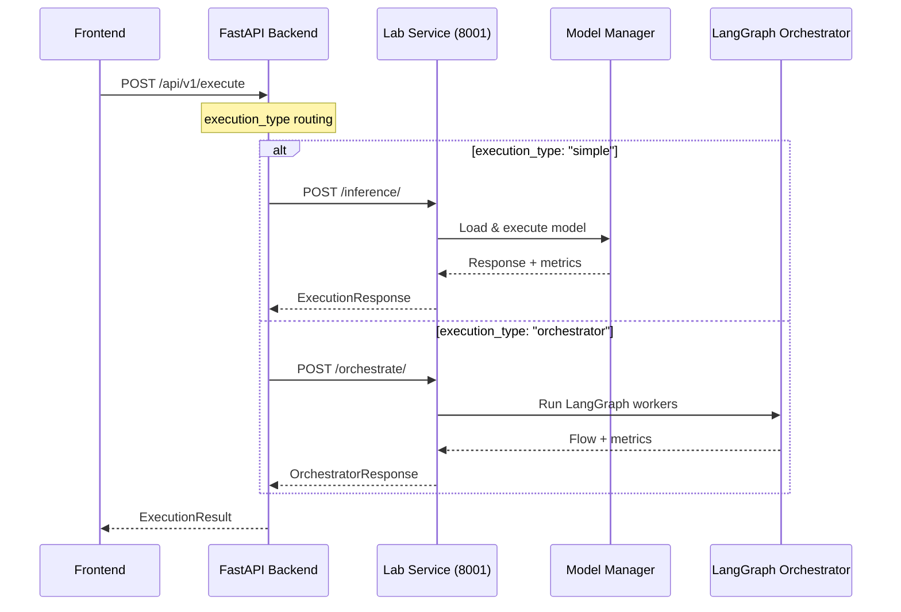

# Backend Architecture — AI Agent Lab API Layer

## 🎯 Objetivo

Exponer una API desacoplada y robusta para conectar el frontend del laboratorio con LangGraph y modelos LLM. Esta capa será responsable de:

- Recibir prompts y parámetros desde el frontend
- **Ejecutar tareas usando simple LLM u orchestrator LangGraph**
- **Routing inteligente entre execution_type: 'simple' vs 'orchestrator'**
- **Health checks modulares y eficientes**
- Emitir eventos a WebSocket (progreso/output)
- Persistir ejecuciones y logs en PostgreSQL

## 🧰 Stack Tecnológico

- **FastAPI**: Framework principal (ASGI-ready)
- **httpx**: Cliente HTTP async para comunicación con Lab Service
- **Pydantic**: Validación de schemas y tipos
- **Uvicorn**: Servidor ASGI para desarrollo
- **Redis**: Pub/Sub entre backend y WebSocket *(futuro)*
- **Node.js** (opcional): WebSocket server independiente *(futuro)*
- **PostgreSQL**: Historial de ejecuciones y métricas *(futuro)*
- **Docker Compose**: Entorno completo para despliegue local *(futuro)*

## 🔗 Flujo Principal



## 🛡️ Seguridad

- CORS configurado para localhost:3000 (frontend) y localhost:8001 (lab)
- Validación estricta con Pydantic schemas
- Health checks modulares en `/api/v1/health`
- Logging estructurado por execution ID
- Throttling por IP (middleware futuro)
- JWT/token authentication (futuro)

## 📁 Estructura de Carpetas

```
backend/
├── app/
│   ├── main.py                    # ✅ Entrypoint con health router
│   ├── api/                       # Endpoints REST modulares
│   │   └── v1/
│   │       ├── routes/
│   │       │   ├── execute.py     # POST /api/v1/execute (routing)
│   │       │   └── health.py      # ✅ GET /api/v1/health (modulares)
│   │       ├── schemas/
│   │       │   ├── execution.py   # ✅ ExecutionRequest con execution_type
│   │       │   ├── health.py      # ✅ Health schemas separados
│   │       │   └── types.py       # FlowState, ExecutionMetrics, etc.
│   ├── core/                      # Configuración y servicios globales
│   │   ├── config.py              # Lectura de .env, parámetros
│   │   ├── logger.py              # Logging con IDs de request
│   │   └── redis.py               # Cliente de Redis (pub/sub) - futuro
│   ├── services/
│   │   ├── executor.py            # ✅ Routing simple vs orchestrator
│   │   └── health_checker.py      # ✅ Lógica de health checks
│   ├── sockets/
│   │   └── manager.py             # Conexión con WS (futuro)
│   └── db/
│       └── models.py              # ORM/SQL para guardar resultados (futuro)
├── tests/
│   ├── test_execute.py            # Test unitario para POST /execute
│   └── test_health.py             # ✅ Tests para health checks
├── Dockerfile                     # Imagen base del backend (futuro)
└── docker-compose.yml             # Orquestador con Redis, Postgres (futuro)
```

## 📄 Detalles por Módulo

### app/api/v1/routes/execute.py ✅

- Define el endpoint `POST /api/v1/execute`
- Routing inteligente basado en `execution_type`
- Valida input con `ExecutionRequest` (simple + orchestrator)
- Delega a `services.executor.execute_prompt()`

### app/api/v1/routes/health.py ✅ NUEVO

- Health checks modulares: `/health`, `/health/detailed`, `/ready`
- Verificación de componentes del sistema
- Separado de lógica de ejecución

### app/api/v1/schemas/ ✅

- **execution.py**: `ExecutionRequest` con `execution_type`, agents, tools
- **health.py**: Schemas para health checks (separado por dominio)
- **types.py**: `FlowState`, `NodeState`, `ExecutionMetrics` compartidos

### app/services/executor.py ✅

- Routing principal: decide entre simple LLM vs orchestrator
- Comunicación async con Lab Service via httpx
- Error handling y fallbacks
- Mapping de respuestas Lab → Frontend

### app/services/health_checker.py ✅ NUEVO

- Lógica centralizada de health checks
- Verificación de componentes sin acoplamiento
- Extensible para futuras verificaciones (Redis, DB, etc.)

### app/core/

- **config.py**: Configuración de entorno
- **logger.py**: Logging estructurado (futuro)
- **redis.py**: Cliente pub/sub (futuro)

## 🔄 Flujo de Ejecución Detallado

### Simple LLM Flow:

1. Frontend → `POST /api/v1/execute` con `execution_type: "simple"`
2. Backend → `services.executor._execute_simple_llm()`
3. Backend → Lab Service `POST /inference/`
4. Lab → ModelManager (carga/ejecución)
5. Lab → Backend (ExecutionResponse)
6. Backend → Frontend (ExecutionResult)

### Orchestrator Flow:

1. Frontend → `POST /api/v1/execute` con `execution_type: "orchestrator"`
2. Backend → `services.executor._execute_orchestrator_via_api()`
3. Backend → Lab Service `POST /orchestrate/`
4. Lab → LangGraph (workers: analyzer, monitor, executor, validator)
5. Lab → Backend (OrchestratorResponse con flow completo)
6. Backend → Frontend (ExecutionResult con múltiples nodos)

## 🏗️ Arquitectura de Comunicación

```
┌─────────────┐    HTTP/JSON    ┌─────────────┐    Python calls    ┌─────────────┐
│  Frontend   │◄──────────────►│   Backend   │◄─────────────────►│ Lab Service │
│ (Next.js)   │   Port 8000     │  (FastAPI)  │    Port 8001      │  (FastAPI)  │
│             │                 │             │                   │             │
└─────────────┘                 └─────────────┘                   └─────────────┘
                                       │                                   │
                                       │                                   ▼
                                       │                          ┌─────────────┐
                                       │                          │ LangGraph   │
                                       │                          │ Workers     │
                                       │                          └─────────────┘
                                       │                                   │
                                       │                                   ▼
                                       │                          ┌─────────────┐
                                       │                          │Model Manager│
                                       │                          │& Executors  │
                                       │                          └─────────────┘
                                       ▼
                                ┌─────────────┐
                                │Health Checks│
                                │& Monitoring │
                                └─────────────┘
```

## ✅ Buenas Prácticas Implementadas

- ✅ Módulos desacoplados (api/core/services separados por responsabilidad)
- ✅ Tipos compartidos entre API y lógica de negocio
- ✅ Health checks eficientes sin uso innecesario de GPU
- ✅ Routing flexible para diferentes tipos de ejecución
- ✅ Error handling robusto con fallbacks
- ✅ Logging estructurado por execution ID
- ✅ Comunicación async para no bloquear el backend
- ✅ Schemas validados con Pydantic
- ✅ Arquitectura escalable para futuros endpoints

## 🚀 Endpoints Disponibles

| Endpoint | Método | Descripción | Status |
|----------|---------|-------------|---------|
| `/api/v1/execute` | POST | Ejecución de prompts (simple/orchestrator) | ✅ |
| `/api/v1/health` | GET | Health check básico | ✅ |
| `/api/v1/health/detailed` | GET | Health check con componentes | ✅ |
| `/api/v1/ready` | GET | Readiness probe | ✅ |
| `/api/v1/models` | GET | Lista de modelos disponibles | 🔄 |
| `/api/v1/metrics` | GET | Métricas del sistema | 🔮 |
| `/api/v1/history` | GET | Historial de ejecuciones | 🔮 |

**Leyenda**: ✅ Implementado | 🔄 En desarrollo | 🔮 Futuro

## 🔮 Roadmap Futuro

- **WebSocket Support**: Para streaming de tokens en tiempo real
- **PostgreSQL Integration**: Persistencia de historial y métricas
- **Redis Pub/Sub**: Para comunicación asíncrona
- **Authentication**: JWT/token para seguridad
- **Rate Limiting**: Throttling por usuario/IP
- **Docker Compose**: Orquestación completa del stack
- **Monitoring Dashboard**: Métricas avanzadas del sistema

## 📝 Cambios Principales

Los principales cambios reflejan:

1. ✅ **Routing simple vs orchestrator**
2. ✅ **Health checks modulares**
3. ✅ **Comunicación HTTP async con Lab**
4. ✅ **Schemas actualizados**
5. ✅ **Arquitectura de comunicación clara**
6. ✅ **Endpoints implementados vs futuros**